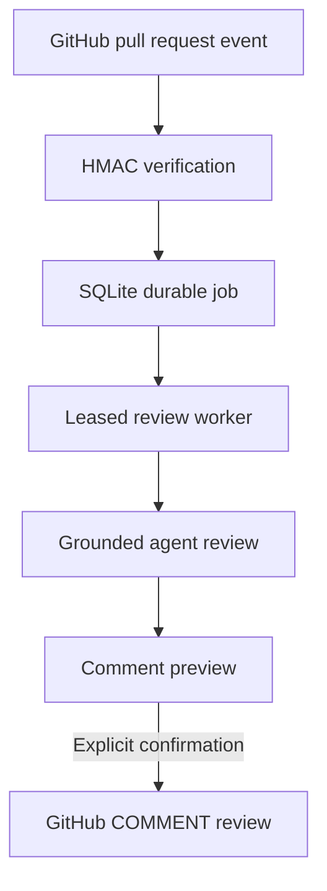

# MergeScope AI project plan

## Product boundary

MergeScope AI is a local, Docker-free review workspace. It supports manual reviews and signed
GitHub App events without requiring Jira, Redis, Docker, or an external job service.

## Product workflow

Webhook HTTP requests finish after durable enqueue. The worker independently claims jobs, checks
the expected head SHA, runs the Phase 2 review graph, and records the resulting review ID. Publishing
is never automatic: it has its own server feature flag, preview endpoint, user confirmation, current
head check, and recovery marker.

Phase 4 adds a separate measurement loop: versioned local cases run through the same orchestrator,
then exact path/line/category matching produces reproducible quality metrics stored in SQLite.

## Component map

| Area | Responsibility | Implementation |
|---|---|---|
| Dashboard | Reviews, knowledge, workflow readiness, jobs, previews | React + TypeScript |
| API | Manual reviews, webhooks, queue state, and publication | FastAPI |
| Review graph | Conditional specialists and deterministic validation | LangGraph + OpenAI |
| GitHub App auth | JWT and installation-token lifecycle | PyJWT + `httpx` |
| Webhook boundary | Raw-body HMAC verification and event filtering | Python `hmac` |
| Durable queue | Deduplication, leases, retries, and recovery | SQLite transactions |
| Worker | Claim jobs and enforce expected PR heads | Async background task |
| Publisher | Preview, confirm, revalidate head, create review | GitHub Reviews REST API |
| Knowledge retrieval | Embed and rank repository-specific guidance | OpenAI embeddings + SQLite |
| Evaluation runner | Labeled suite, exact matching, token/cost metrics | OpenAI + SQLite |
| Policy registry | Allowlist and per-repository review behavior | Environment + JSON |
| Observability | Request/job correlation and structured events | Context variables + JSON logs |
| Backup | Online consistent copy, integrity check, retention | Python `sqlite3` backup API |

## Weekend delivery plan

### Weekend 1 — foundation and manual dry run

- [x] Docker-free FastAPI and React workspace
- [x] Manual GitHub PR retrieval and typed OpenAI review
- [x] SQLite history, detail, and responsive dashboard
- [x] Mocked tests, lint, audit, and production build

Exit condition met: a public PR can be reviewed locally without Jira or Docker.

### Weekend 2 — stronger review grounding

- [x] Exact added-line parsing and post-model validation
- [x] Repository and embedded document guidance
- [x] Code, conditional security, testing, and synthesis nodes
- [x] Head-SHA/prompt cache and deterministic demo
- [x] Agent, context, cache, and diff evidence UI

Exit condition met: every accepted finding is traceable to a valid added line.

### Weekend 3 — GitHub workflow integration

- [x] GitHub App RS256 authentication and installation tokens
- [x] HMAC-SHA256 webhook signature verification
- [x] Persistent SQLite job queue with leases and retry backoff
- [x] Delivery and PR-head idempotency
- [x] Stale-head supersession before review and publication
- [x] Comment payload preview and accessible confirmation dialog
- [x] Explicit, disabled-by-default GitHub publishing mode
- [x] Publish recovery marker to prevent duplicate GitHub reviews

Exit condition met: a PR event can schedule one durable review, and only validated comments can be
published after explicit confirmation.

### Weekend 4 — evaluation and operational readiness

- [x] Create a labeled evaluation set with good, bad, and adversarial diffs
- [x] Measure precision, recall, invalid-line rate, latency, tokens, and estimated model cost
- [x] Add request correlation IDs and structured logs
- [x] Add repository allowlists and configurable review policies
- [x] Package a non-Docker deployment and SQLite backup procedure

Exit condition met: review quality and failure behavior are measurable before controlled expansion.

## Important engineering decisions

1. **Webhook work is asynchronous.** GitHub receives a fast response after the job is committed.
2. **SQLite remains the source of truth.** `BEGIN IMMEDIATE` serializes claims and deduplication;
   worker leases recover interrupted jobs.
3. **A head SHA is a workflow identity.** A changed PR creates a new job and makes older work stale.
4. **Reviewing and publishing are separate capabilities.** Review generation stays read-only, while
   the only write endpoint requires configuration, an operator token, and literal confirmation.
5. **The validator owns comments.** Only accepted added-line findings enter the preview payload.
6. **GitHub review event is `COMMENT`.** MergeScope does not approve or request changes on behalf of
   a user.
7. **Publication is recoverable.** A deterministic marker lets a retry detect an already-created
   GitHub review after a timeout.
8. **Private keys stay outside version control.** The preferred setup references a local PEM path.
9. **Evaluation costs require confirmation.** The evaluation route has a distinct operator token;
   token prices are explicit configuration rather than hard-coded assumptions.
10. **Policy is resolved before model work.** Disallowed repositories never enqueue or invoke the
    review graph, repository overrides merge over a validated default, and the resolved policy is
    part of cache and webhook-job identity.
11. **Logs contain identifiers, not content.** Correlation IDs connect HTTP and background work
    without recording diffs, prompts, payloads, or secrets.
12. **Backups use SQLite's online API.** Every copy passes `integrity_check`, receives a SHA-256
    manifest, and is pruned only after the new backup succeeds.

## Phase 4 test path

1. Load **Evaluation** and verify the six versioned cases are grouped as good, bad, and adversarial.
2. Configure current model token rates and a separate evaluation operator token.
3. Run the suite and inspect precision, recall, invalid-line rate, latency, tokens, and case details.
4. Configure one repository in `ALLOWED_REPOSITORIES`; verify another repository is rejected before
   OpenAI work and its signed webhook is ignored.
5. Copy the policy example, enable publishing only for a test repository, and verify other repos
   remain blocked even if the global publishing flag is on.
6. Send an `X-Request-ID` and confirm the same value is returned and appears in structured logs.
7. Run the backup CLI while the API is active; verify its JSON manifest and restore the copy into a
   temporary database path.
8. Run the full test, lint, frontend build, and dependency-audit commands.
