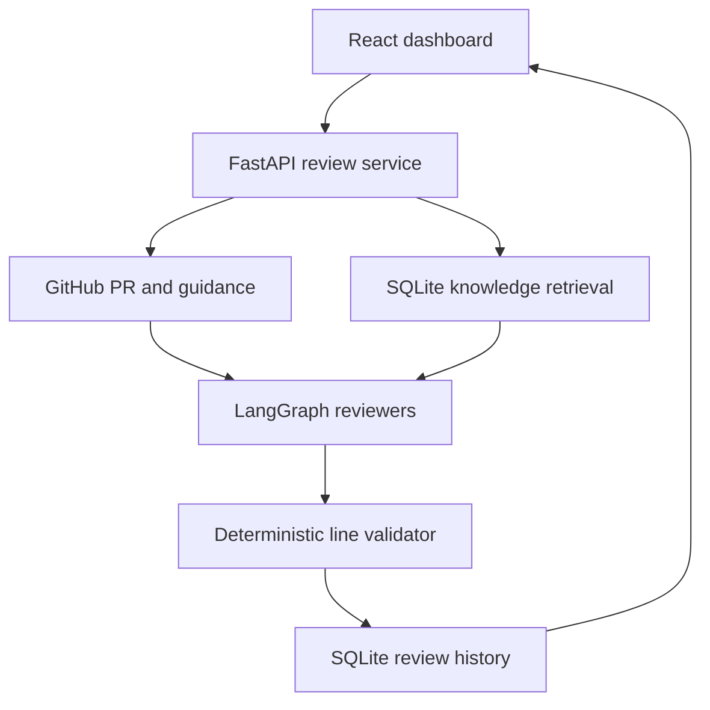

# MergeScope AI project plan

## Product boundary

MergeScope AI is a local, Docker-free review workspace. A developer submits a GitHub pull-request
URL, MergeScope obtains the changed files and repository guidance, retrieves relevant local
knowledge, runs specialized OpenAI reviewers, validates their findings against exact added lines,
and stores the run in SQLite.

Jira remains optional metadata. It is not contacted and is not a runtime dependency.

## Phase 2 request flow

The review graph always runs the code and testing reviewers. It conditionally adds the security
reviewer when paths or patches touch sensitive concepts, then asks a synthesizer for the narrative.
The final validator rejects ungrounded findings and independently calculates the approval verdict.

## Component map

| Area | Responsibility | Implementation |
|---|---|---|
| Dashboard | Start reviews, manage knowledge, inspect agents/evidence/history | React + Vite + TypeScript |
| API | Validate and expose review and knowledge resources | FastAPI |
| Review graph | Route specialists and aggregate usage | LangGraph `StateGraph` |
| Review specialists | Inspect code, security, and testing risks | OpenAI Responses structured outputs |
| Validator | Enforce changed paths/lines, deduplicate, calculate verdict | Deterministic Python |
| GitHub adapter | Retrieve PR metadata, patches, and repository guidance | `httpx`, token optional |
| Knowledge retrieval | Chunk, embed, rank, and cite local guidance | OpenAI embeddings + cosine similarity |
| Persistence | Store review runs, cache metadata, documents, and vectors | SQLite via `aiosqlite` |
| Ticket context | Preserve an optional reference without Jira | Local string metadata |

## Weekend delivery plan

### Weekend 1 — foundation and manual dry run

- [x] Docker-free FastAPI and React workspace
- [x] Environment configuration without committed secrets
- [x] Public/private GitHub PR retrieval
- [x] Typed OpenAI review result
- [x] SQLite history and review detail
- [x] Responsive dashboard and setup guidance
- [x] Mocked tests, lint, dependency audit, and production build

Exit condition met: a developer with an OpenAI key can review a public PR locally without Jira or
Docker.

### Weekend 2 — stronger review grounding

- [x] Build an exact added-line map from unified patches
- [x] Load `AGENTS.md`, contribution guidance, and the PR template
- [x] Add local document ingestion and OpenAI embedding retrieval
- [x] Add prompt-version and head-SHA cache keys with force-refresh support
- [x] Add code, conditional security, testing, and synthesis graph nodes
- [x] Reject invalid paths, invalid/missing lines, and duplicate findings
- [x] Show agents, context sources, cache state, and diff excerpts in the UI
- [x] Add a deterministic demo requiring no external API calls

Exit condition met: every accepted finding is traceable to a valid added line and its supplied
review context is visible in the dashboard.

### Weekend 3 — GitHub workflow integration

- [ ] Add GitHub App authentication and webhook signature verification
- [ ] Move external review jobs to a persistent worker model
- [ ] Add idempotency for webhook retries and PR head changes
- [ ] Preview comments before publishing
- [ ] Add an explicit, opt-in GitHub publishing mode

Exit condition: a PR event can safely schedule one durable review and publish only validated
comments.

### Weekend 4 — evaluation and operational readiness

- [ ] Create a labeled evaluation set with good, bad, and adversarial diffs
- [ ] Measure precision, invalid-line rate, latency, and estimated model cost
- [ ] Add retry/backoff policies and request correlation IDs
- [ ] Add repository allowlists and configurable review policies
- [ ] Package a non-Docker deployment guide and backup procedure

Exit condition: review quality and failure behavior are measurable before broader use.

## Important engineering decisions

1. **SQLite is the source of truth.** It keeps the setup small and now stores both reviews and
   knowledge vectors.
2. **Dry run is enforced by the server.** No GitHub write adapter exists, so the UI cannot publish
   accidentally.
3. **All retrieved content is untrusted.** Model instructions separate data from system behavior.
4. **Structured output is mandatory.** Each model response is parsed against a Pydantic schema.
5. **The validator owns trust.** Model findings are accepted only when their file and line match an
   actual added line; the model's proposed approval cannot override the deterministic verdict.
6. **Security review is conditional.** Obvious low-risk changes avoid one model call, while paths or
   patches involving authentication, secrets, sessions, queries, and related boundaries include it.
7. **Cache identity is explicit.** Repository, PR number, head SHA, and prompt version prevent stale
   reuse; the UI can force a fresh run.
8. **External clients are replaceable.** Tests use fake GitHub, OpenAI, and embedding adapters.

## Test strategy without Jira

1. Run the automated suite; it covers diff parsing, reviewer routing, deterministic validation,
   caching, document retrieval, API resources, and SQLite persistence.
2. Start the app without credentials and run the deterministic demo.
3. Confirm agents, valid line excerpts, and context sources appear in the inspector.
4. Add an OpenAI key, index a small guidance document, and run a public PR review.
5. Repeat the same PR to confirm a cache hit, then enable force re-review to bypass it.
6. Leave Ticket reference empty or use `LOCAL-101`; confirm no Jira request occurs.
