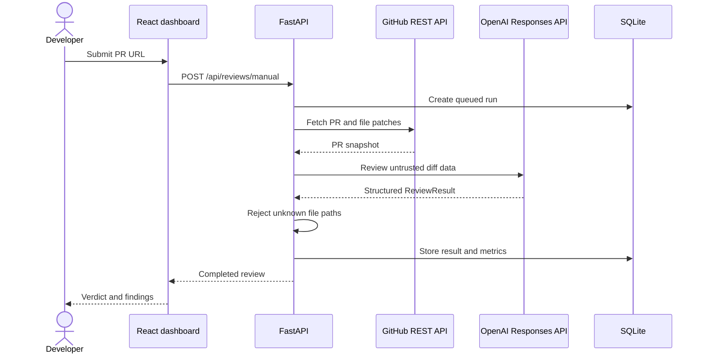

# MergeScope AI project plan

## Product boundary

MergeScope AI starts as a local, Docker-free review workspace. A developer submits a GitHub pull-request URL, MergeScope obtains the changed files, asks an OpenAI model for a schema-validated review, verifies that findings point to changed files, and stores the run in SQLite.

Jira is not a runtime dependency. A ticket reference is optional metadata until a ticket-provider interface is introduced in a later milestone.

## Current request flow

## Component map

| Area | Responsibility | Current implementation |
|---|---|---|
| Dashboard | Submit reviews, show readiness, history, and findings | React + Vite + TypeScript |
| API | Validate requests and expose review resources | FastAPI |
| Review service | Coordinate GitHub, model, validation, and persistence | Async Python service |
| GitHub adapter | Parse PR URLs and retrieve metadata/patches | `httpx`, token optional |
| Model adapter | Produce typed findings and usage metadata | OpenAI Responses API structured output |
| Persistence | Store runs, results, status, and metrics | SQLite via `aiosqlite` |
| Ticket context | Preserve an optional reference without requiring Jira | Local string metadata |

## Weekend delivery plan

### Weekend 1 — foundation and manual dry run

- [x] Docker-free FastAPI and React workspace
- [x] Environment configuration without committed secrets
- [x] Public/private GitHub PR retrieval
- [x] Typed OpenAI review result
- [x] SQLite history and review detail
- [x] Responsive dashboard and setup guidance
- [x] Mocked tests, lint, dependency audit, and production build

Exit condition: a developer with an OpenAI key can review a public PR locally without Jira or Docker.

### Weekend 2 — stronger review grounding

- Build an exact changed-line map from unified patches
- Accept inline repository guidance such as `AGENTS.md` and review checklists
- Add local document ingestion and OpenAI embeddings for relevant context
- Add prompt-version and head-SHA cache keys
- Show skipped/truncated files and context sources in the UI
- Add a deterministic fixture mode for demos without external API calls

Exit condition: findings are traceable to valid changed lines and relevant repository guidance.

### Weekend 3 — GitHub workflow integration

- Add GitHub App authentication and webhook signature verification
- Move external review jobs to a persistent worker model
- Add idempotency for webhook retries and PR head changes
- Preview comments before publishing
- Add an explicit, opt-in GitHub publishing mode

Exit condition: a PR event can safely schedule one durable review and publish only validated comments.

### Weekend 4 — evaluation and operational readiness

- Create a labeled evaluation set with good, bad, and adversarial diffs
- Measure precision, invalid-line rate, latency, and estimated model cost
- Add retry/backoff policies and request correlation IDs
- Add repository allowlists and configurable review policies
- Package a non-Docker deployment guide and backup procedure

Exit condition: review quality and failure behavior are measurable before broader use.

## Important engineering decisions

1. **SQLite is the source of truth.** It keeps the local setup small and supports the current query patterns with explicit indexes.
2. **Dry run is enforced by the server.** The UI cannot accidentally enable GitHub writes because no write adapter exists yet.
3. **PR content is untrusted.** The model instructions explicitly ignore commands embedded in titles, descriptions, comments, and source code.
4. **Structured output is mandatory.** Review parsing uses a Pydantic schema instead of best-effort JSON cleanup.
5. **Findings are validated after generation.** The current milestone rejects findings for files not present in the PR; exact line validation is the next guardrail.
6. **External clients are replaceable.** GitHub and OpenAI are isolated behind small adapters so tests do not need network access.
7. **The model is configuration, not architecture.** `OPENAI_MODEL` can be changed without modifying the review workflow.

## Test strategy without Jira

1. Run the automated test suite; fake GitHub and model adapters cover the complete service flow.
2. Start the app with `OPENAI_API_KEY` configured.
3. Use a small public PR and leave Ticket reference empty.
4. Run a second review with `LOCAL-101` to verify optional metadata.
5. Confirm both runs appear in history and no comment appears on GitHub.
