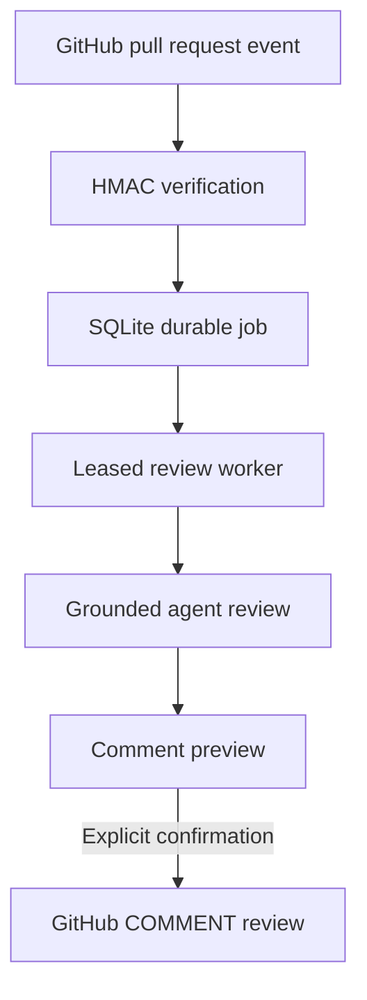

# MergeScope AI project plan

## Product boundary

MergeScope AI is a local, Docker-free review workspace. It supports manual reviews and signed
GitHub App events without requiring Jira, Redis, Docker, or an external job service.

## Phase 3 workflow

Webhook HTTP requests finish after durable enqueue. The worker independently claims jobs, checks
the expected head SHA, runs the Phase 2 review graph, and records the resulting review ID. Publishing
is never automatic: it has its own server feature flag, preview endpoint, user confirmation, current
head check, and recovery marker.

## Component map

| Area | Responsibility | Implementation |
|---|---|---|
| Dashboard | Reviews, knowledge, workflow readiness, jobs, previews | React + TypeScript |
| API | Manual reviews, webhooks, queue state, and publication | FastAPI |
| Review graph | Conditional specialists and deterministic validation | LangGraph + OpenAI |
| GitHub App auth | JWT and installation-token lifecycle | PyJWT + `httpx` |
| Webhook boundary | Raw-body HMAC verification and event filtering | Python `hmac` |
| Durable queue | Deduplication, leases, retries, and recovery | SQLite transactions |
| Worker | Claim jobs and enforce expected PR heads | Async background task |
| Publisher | Preview, confirm, revalidate head, create review | GitHub Reviews REST API |
| Knowledge retrieval | Embed and rank repository-specific guidance | OpenAI embeddings + SQLite |

## Weekend delivery plan

### Weekend 1 — foundation and manual dry run

- [x] Docker-free FastAPI and React workspace
- [x] Manual GitHub PR retrieval and typed OpenAI review
- [x] SQLite history, detail, and responsive dashboard
- [x] Mocked tests, lint, audit, and production build

Exit condition met: a public PR can be reviewed locally without Jira or Docker.

### Weekend 2 — stronger review grounding

- [x] Exact added-line parsing and post-model validation
- [x] Repository and embedded document guidance
- [x] Code, conditional security, testing, and synthesis nodes
- [x] Head-SHA/prompt cache and deterministic demo
- [x] Agent, context, cache, and diff evidence UI

Exit condition met: every accepted finding is traceable to a valid added line.

### Weekend 3 — GitHub workflow integration

- [x] GitHub App RS256 authentication and installation tokens
- [x] HMAC-SHA256 webhook signature verification
- [x] Persistent SQLite job queue with leases and retry backoff
- [x] Delivery and PR-head idempotency
- [x] Stale-head supersession before review and publication
- [x] Comment payload preview and accessible confirmation dialog
- [x] Explicit, disabled-by-default GitHub publishing mode
- [x] Publish recovery marker to prevent duplicate GitHub reviews

Exit condition met: a PR event can schedule one durable review, and only validated comments can be
published after explicit confirmation.

### Weekend 4 — evaluation and operational readiness

- [ ] Create a labeled evaluation set with good, bad, and adversarial diffs
- [ ] Measure precision, invalid-line rate, latency, and estimated model cost
- [ ] Add request correlation IDs and structured logs
- [ ] Add repository allowlists and configurable review policies
- [ ] Package a non-Docker deployment and SQLite backup procedure

Exit condition: review quality and failure behavior are measurable before broader use.

## Important engineering decisions

1. **Webhook work is asynchronous.** GitHub receives a fast response after the job is committed.
2. **SQLite remains the source of truth.** `BEGIN IMMEDIATE` serializes claims and deduplication;
   worker leases recover interrupted jobs.
3. **A head SHA is a workflow identity.** A changed PR creates a new job and makes older work stale.
4. **Reviewing and publishing are separate capabilities.** Review generation stays read-only, while
   the only write endpoint requires configuration, an operator token, and literal confirmation.
5. **The validator owns comments.** Only accepted added-line findings enter the preview payload.
6. **GitHub review event is `COMMENT`.** MergeScope does not approve or request changes on behalf of
   a user.
7. **Publication is recoverable.** A deterministic marker lets a retry detect an already-created
   GitHub review after a timeout.
8. **Private keys stay outside version control.** The preferred setup references a local PEM path.

## Phase 3 test path

1. Run the deterministic demo and confirm publication is blocked.
2. Configure the GitHub App with publishing disabled.
3. Deliver a signed `ping`, then open or update a PR.
4. Open **Workflow center** and verify the job becomes completed with one result.
5. Redeliver the same event and confirm no second job is created.
6. Inspect the comment preview for exact paths and added lines.
7. Enable publishing only in a test repository, restart the server, and explicitly confirm once.
8. Push another commit and confirm the previous review can no longer publish.
